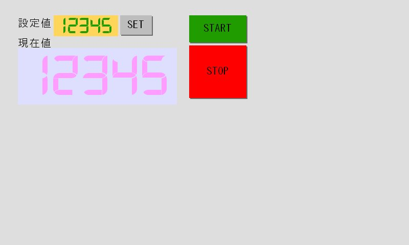

# GOP-CT70A Linux用ホストサンプル
raspberry piとGOP-CT70AをUSB接続で通信するサンプルです。  
USBで接続するとGOP-CT70AはttyACM0として認識されます。  
ttyACM0をシリアルポートとして開きコマンド通信を行います。
## ファイル構成
- sample.cpp  
ホストアプリケーションのメインモジュールです。
ここでシリアルポートを初期し、メインループを回します。
- goplt_if.cpp  
GOP-CT70Aのコマンド処理をライブラリ化したモジュールです。(GOP通信ライブラリ)
原則修正は必要ありません。
動作のため以下の3つの関数をシステム側で定義する必要があります。
 ```C
uint32_t get_syscount();	//システム時刻をms単位で取得
int uart_getc();			//ポートから1バイト取得　データない場合は-1を返す
void uart_putc(char c);		//ポートから1バイト出力
 ```
これらの関数はsample.cで記述しています。
- goplt_if.h  
goplt_if.cppのヘッダーファイルです。  
このファイルをホストアプリケーションのソースで#includeします。

- CMakeLists.txt  
CMake プロジェクトファイルです。
- buildフォルダー  
CMakeビルド作業用フォルダーです
- contents/sample1.etlx  
画面データファイルです。


## サンプルアプリケーションの動作
サンプルでは以下のような画面でホストのコードを作成します。  
  
動作としてはGOP側の動作で設定値に値をセットし、STARTを押されたらホスト側は設定値に近づくよう現在値を増減させます。    

## 画面データ
画面データは<a href="./contents/sample1.etlx" download="sample1.etlx">/contents/sample1.etlx</a>から取得できます。  
画面データは以下のメモリーを用意します。  
  用途   |  メモリー名  
  ---     |   ---
  設定値  |  SV_1  
  現在値  |  PV_1  

また動作は以下のように設定します
  操作  | アクション
  ---     |   ---
  SETボタンまたは設定値カウンター |  キーパッドを開き値設定</br> 確定後メッセージ"SET"を出力
  STARTボタン |  メッセージ"START"を出力
  STOPボタン  |メッセージ"STOP"を出力

## ホストソース
sample.cに一通りの処理を記述しています。  
### Linux側の準備
- シリアル通信の初期化  
GOP通信ライブラリは1バイト単位の送受信が可能な動作が必要です。  
そのため非カノニカルで動作するようにシリアルポートを初期化します。
```C
#define SERIAL_PORT "/dev/ttyACM0"  // ファイルディスクリプタ

static int fd=0;
void Serial_Init(){
    struct termios tio;                 // シリアル通信設定
    int baudRate = B115200;
    int i;
    int len;
    int ret;
    int size;
//シリアルポートの初期化
    fd = open(SERIAL_PORT, O_RDWR);     // デバイスをオープンする
    if (fd < 0) {
        printf("open error\n");
        return -1;
    }
    //非カノニカルモードで動作させるための設定
    tio.c_cflag += CREAD;               // 受信有効
    tio.c_cflag += CLOCAL;              // ローカルライン（モデム制御なし）
    tio.c_cflag += CS8;                 // データビット:8bit
    tio.c_cflag += 0;                   // ストップビット:1bit
    tio.c_cflag += 0;                   // パリティ:None
    cfsetispeed( &tio, baudRate );
    cfsetospeed( &tio, baudRate );
    tio.c_iflag=IGNPAR | ICRNL; 

    cfmakeraw(&tio);                    // RAWモード
    //受信タイムアウトを待たないよう設定
    tio.c_cc[VTIME]=0;                  
    tio.c_cc[VMIN]=0;
    tcsetattr( fd, TCSANOW, &tio );     // デバイスに設定を行う

    ioctl(fd, TCSETS, &tio);            // ポートの設定を有効にする

}
```
- GOP通信ライブラリの必要関数 1バイト送受信
```C
/ポートから1バイト取得 データない場合は-1を返す
int uart_getc(){
    char buf[1];
    int c;
    if(read(fd,buf,1)){
        c=buf[0];
    }else{
        c=-1;
    }
    debug_put_console(c);
    return c;
}

//ポートから1バイト出力
void uart_putc(char c){
    char buf[1];
    buf[0]=c;
    write(fd,buf,1);
    debug_put_console(c);
}
```
- GOP通信ライブラリの必要関数 システム時刻を1ms単位で取得
```C
//システム時刻をms単位で取得
uint32_t get_syscount(){
    uint32_t _systime=0;
    static struct timespec _sttime={0,0};
    if(_sttime.tv_sec==0&&_sttime.tv_nsec==0){
        clock_gettime(CLOCK_REALTIME, &_sttime);
    }else{
        struct timespec _nowtime;
        clock_gettime(CLOCK_REALTIME, &_nowtime);
        _systime=(_nowtime.tv_sec-_sttime.tv_sec)*1000+(_nowtime.tv_nsec-_sttime.tv_nsec)/1000000;

    }

    return _systime;
}
```
### アプリケーションの動作
- メッセージに対するハンドラー  
ltMes_Callback型の配列に受け取ったメッセージ(TPデザイナーLTで設定した内容。STX等のパケット識別用の文字はGOP通信ライブラリで取り払われます)と  
そのメッセージに対応した関数[void (*func)(void)型]を登録します。
```C

int32_t sv_1,pv_1;
BOOL run_flag=FALSE;    //運転状態のフラグ

//メッセージ"START"受信時 運転フラグをセット
void fnSTART()
{
    run_flag=TRUE;
}
//メッセージ"STOP"受信時 運転フラグをリセット
void fnSTOP()
{
    run_flag=FALSE;
}
//メッセージ"SET"受信時 GOPのメモリーSV_1の値をホスト側の変数sv_1に読み込み
void fnSET()
{
    LtMemRead("SV_1",&sv_1);
}

//メッセージ対するハンドラー関数の設定
ltMes_Callback tbl[]={
    {"START",fnSTART},
    {"STOP",fnSTOP},
    {"SET",fnSET},
    {NULL,NULL} //ハンドラーテーブルの終端を示すため、最後の行に｛NULL,NULL｝を登録
};
```
- メインループ  
シリアル初期化しハンドラーテーブルの登録後  
メッセージループを回します。  
この中でLtEnqを呼び出すことでメッセージに応じた処理を呼び出すことができます。  
また、このループ内でホスト側の状態に応じた処理を行います。  
本アプリケーションの場合、pv_1の値を増減しGOP側のPV_1に書き込みます。

```c
//運転フラグセット時の動作
//pv_1をsv_1に近づけるよう値を増減
//増減した結果をGOPのメモリーPV_1に書き込み
void run()
{
    int d=sv_1-pv_1;
    if(d<=10){
        pv_1-=3;
    }else{
        if(d>100){
            d=10;
        }else {
            d/=10;
        }
        pv_1+=d;
    }
    LtMemWrite("PV_1",pv_1);
}

int main(int argc, char *argv[])
{
    //シリアル通信の初期化
    Serial_Init();

    //メッセージハンドラーを登録
    LtSetMessageCallback(tbl);

    // メインループ
    while(1) {
        if(run_flag){
            run();
        }

        LtEnq(NULL);    //メッセージの受信処理　この関数をメインループで呼ぶとメッセージに応じたハンドラ関数を呼び出します。
    }

    close(fd);                              // デバイスのクローズ
    return 0;
}
```
## ビルド方法
buildフォルダーに移動後  
cmake  
make  
で実行ファイルa.outが作成されます。
```sh
pi@raspberrypi:~/gopct $ cd build
pi@raspberrypi:~/gopct/build $ cmake
Usage

  cmake [options] <path-to-source>
  cmake [options] <path-to-existing-build>

Specify a source directory to (re-)generate a build system for it in the
current working directory.  Specify an existing build directory to
re-generate its build system.

Run 'cmake --help' for more information.

pi@raspberrypi:~/gopct/build $ make
[100%] Built target a.out
pi@raspberrypi:~/gopct/build $ ./a.out
```